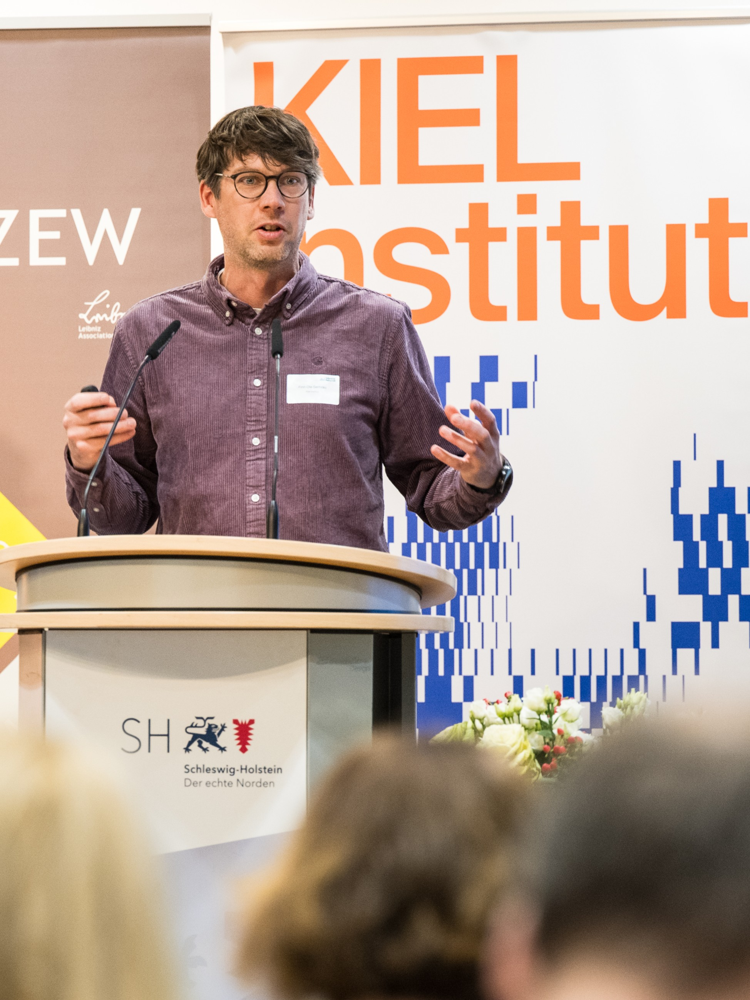
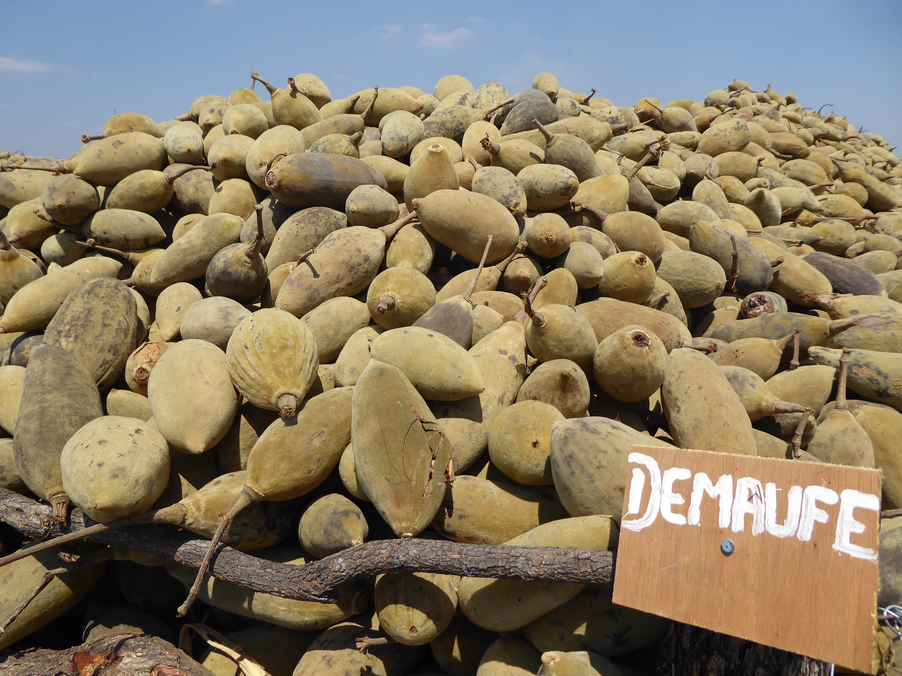

---
---

::: {.home-hero}

::: {.hero-overlay}

ECONOMIST · HAMBURG | KIEL

# Finn Ole Semrau

I study how **global value chains and foreign direct investment** shape firms’ environmental performance, and how governments design **industrial policy** to scale green technologies in the face of international competition and geopolitical pressure.

[Research](research.qmd)
[Policy & Media](policy.qmd)
[CV](cv.qmd)

:::

:::

## About

::: {.about-grid}

::: {.about-photo}

:::

::: {.about-text}

I am an economist and postdoctoral researcher at the [Kiel Institute for the World Economy](https://www.kielinstitut.de/de/expertinnen-und-experten/finn-ole-semrau/){.inline-link}, where I serve as Deputy Scientific Lead of the [Industrial Policy Lab](https://industrialpolicylab.de/de/start/){.inline-link}.

My research sits at the intersection of **international economics, industrial policy and environmental economics**. I study firm behaviour in global value chains, the effects of foreign direct investment and the role of industrial policy in technological competition and the green transformation. I work primarily with firm-level and policy data and use applied microeconometric methods.

I connect this research to policy and practice by working with ministries, international organisations and firms, contributing to applied projects and engaging in public debate.

[More about my research →](research.qmd)

:::

:::

## Selected Research

::: {.paper-list}

::: {.paper-item}

JOURNAL OF ENVIRONMENTAL ECONOMICS AND MANAGEMENT · 2026

### Upstreamness, Foreign Environmental Regulation and CO₂ Emissions in Indian Manufacturing Firms

Why upstream firms are more emission-intensive and whether exports to markets with stringent environmental regulation encourage cleaner production.

[View publication →](https://doi.org/10.1016/j.jeem.2026.103324)

:::

::: {.paper-item}

JOURNAL OF DEVELOPMENT ECONOMICS · 2024

### Corporate Social Responsibility along the Global Value Chain

How buyer–supplier relationships in global value chains create incentives for firms to adopt corporate social responsibility.

[View publication →](https://www.sciencedirect.com/science/article/pii/S030438782300192X)

:::

::: {.paper-item}

JOURNAL OF INTERNATIONAL BUSINESS POLICY · 2026

### Green Gifts from Abroad? FDI and Firms’ Green Management

When foreign ownership encourages firms to adopt green management practices and how this relationship depends on host- and home-country conditions.

[View publication →](https://doi.org/10.1057/s42214-025-00228-4)

:::

:::

::: {.research-cta}

[Explore all research →](research.qmd){.research-button}

:::

::: {.currently}

CURRENT WORK

My current research examines subnational competition for **hydrogen leadership in China**, public financial support and **policy mixes** for firms’ environmental innovation and the interaction between **foreign ownership**, value-chain position and pollution abatement in Chinese manufacturing.

:::

::: {.policy-image}

Conference of the Industrial Policy Lab · December 2025 · Foto by Stefanie Loos

:::

## Research Themes

::: {.research-grid}

::: {.research-card}

### Industrial Policy & Geoeconomics

The design and effectiveness of policies that seek to build technological capabilities, strengthen competitiveness and reduce strategic dependencies.

:::

::: {.research-card}

### Global Value Chains & FDI

How firms’ positions in international production networks and foreign ownership affect innovation, environmental performance and economic development.

:::

::: {.research-card}

### Green Innovation & Transformation

How public support, regulation and market incentives influence firms’ adoption of environmental innovations and clean technologies.

:::

:::

::: {.policy-text}

RESEARCH MEETS POLICY

## Policy & Public Engagement

My policy work translates economic research and analysis into practical choices about policy design. Through the [Industrial Policy Lab](https://industrialpolicylab.de/de/start/){.inline-link}, I assess how instruments such as public financial support, procurement, local-content requirements and conditions on foreign investment can advance **decarbonisation, resilience and competitiveness** while preserving competition.

Over the past decade, I have contributed to research, evaluation and policy projects for *German federal ministries, the European Parliament, UNIDO and GIZ*. I have also worked with researchers at the *European Commission’s Joint Research Centre* during a three-month research visit in Seville.

I regularly contribute interviews and commentary on economic policy to *dpa, Deutschlandfunk, NDR, MDR, ARD, Table.Media (China.Table) and Tagesspiegel Background*.

[Explore policy & media →](policy.qmd){.research-button}

:::

::: {.consultancy-feature}

::: {.consultancy-photo}

:::

::: {.consultancy-text}

BEYOND ACADEMIA

## Consultancy & International Projects

Since 2016, I have completed more than 20 assignments and over 500 consulting days as an independent consultant and international expert in development cooperation.

My work for **GIZ, GFA Consulting Group, UNIDO and other partners** covers research, survey design, statistical sampling, monitoring and evaluation, training and quality assurance. I have worked as a team leader, coordinator and trainer, with field experience in Mozambique and Kenya.

::: {.consultancy-points}

- **Evaluation & Survey Design**  
  Designing sampling strategies, data collections and quantitative and qualitative evaluations.

- **Project Leadership & Quality Assurance**  
  Coordinating project teams and data collections while ensuring methodological quality.

- **Training & Local Collaboration**  
  Working with institutions, project teams and local partners to translate evidence into practical recommendations.

:::

[Explore consultancy →](consultancy.qmd){.research-button}

:::

:::

