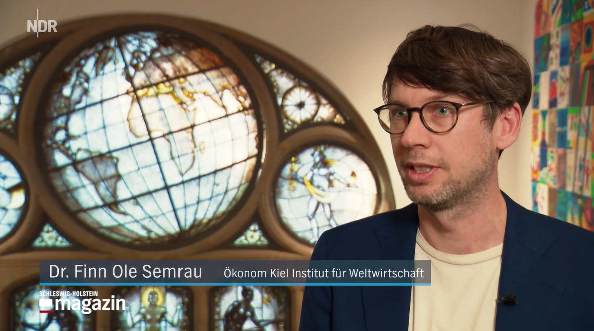
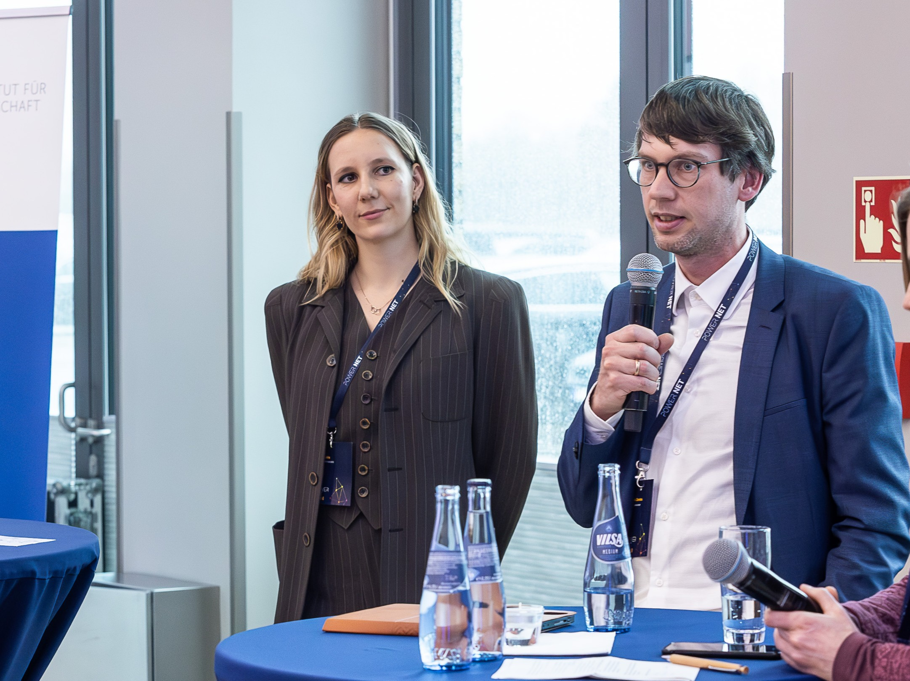

:::::: {.policy-page}

::: {.pp-intro}

I contribute to policy debates on **green industrial policy, industrial decarbonisation and sustainability in global value chains**. My current work examines the design of European industrial policy, including the Industrial Accelerator Act, the scale-up of hydrogen and the implications of Chinese industrial policy for European competitiveness and resilience. I also contribute to debates on sustainable production and trade in global value chains, including coffee and cocoa.

As Deputy Scientific Lead of the [Industrial Policy Lab](https://industrialpolicylab.de/de/start/){.pp-link}, I connect research with policy practice through analysis and regular exchange with ministries, industry and other stakeholders. I focus on when policy intervention is justified, which instruments fit particular objectives and how policy can support transformation while preserving competition.

:::

::: {.pp-media-photo}

NDR Fernsehen · Schleswig-Holstein Magazin · 20 December 2025 · 
[“Warum der Schoko-Weihnachtsmann dieses Jahr so teuer ist”](https://www.ndr.de/nachrichten/schleswig-holstein/warum-der-schoko-weihnachtsmann-dieses-jahr-so-teuer-ist,schokoladenpreise-108.html){.pp-link}  
Screenshot: NDR

:::

## Current Policy Debates

:::: {.pp-topic-grid}

::: {.pp-topic}

### The Industrial Accelerator Act {.pp-topic-title}

I assess the design of the Industrial Accelerator Act and its role in Europe’s response to the China-Shock 2.0, asking whether instruments such as low-carbon procurement, local-content requirements and conditions on foreign investment are well matched to the objectives of decarbonisation, resilience and competitiveness.

:::

::: {.pp-topic}

### Decarbonising Energy-Intensive Industry {.pp-topic-title}

I examine how carbon pricing, innovation support and demand for low-carbon materials can support industrial decarbonisation, with a particular focus on the EU Industrial Accelerator Act.

:::

::: {.pp-topic}

### Hydrogen {.pp-topic-title}

Through the H2ignite project, I work on hydrogen innovation ecosystems in the North Sea region and regularly exchange with industry and policy stakeholders on the challenges of technology development and scale-up.

:::

::: {.pp-topic}

### Understanding Chinese Industrial Policy {.pp-topic-title}

I examine how national priorities, local government competition and support for firms shape China's technological upgrading, including ongoing research on subnational competition for hydrogen leadership, and what this means for Europe's policy response.

:::

::::

## Selected Policy Outputs

:::: {.pp-publications .pp-selected}

::: {.pp-paper #china-shock-wirtschaftsdienst}

Wirtschaftsdienst · 2026 · 106(9)

### China-Schock 2.0 trifft Deutschland: Was kann der Industrial Accelerator Act leisten? {.pp-title lang=de}

Schöl, B.; Semrau, F. O.

Short summary: China-Schock 2.0 trifft Deutschland

China's competitive pressure exposes weaknesses in Germany's export model. We assess where low-carbon and origin requirements can support industrial transformation, why they are ill-suited to counter distortions from Chinese industrial policy and how they should fit within a wider climate, trade and competitiveness policy mix.

<a class="pp-link" href="https://www.wirtschaftsdienst.eu/inhalt/jahr/2026/heft/9/beitrag/china-schock-2-0-trifft-deutschland-was-kann-der-industrial-accelerator-act-leisten.html">Read full text (German) →: China-Schock 2.0 trifft Deutschland</a>

:::

::: {.pp-paper #iaa-intereconomics}

Intereconomics · 2026 · 61(4), 240–248

### The EU Industrial Accelerator Act: Strategic Ambitions and Design Challenges {.pp-title}

Binder, J.; Dohse, D.; Görg, H.; Liu, W.-H.; Schöl, B.; Semrau, F. O.

Short summary: The EU Industrial Accelerator Act

The IAA brings together decarbonisation, resilience and competitiveness without sufficiently matching its instruments to these distinct objectives. We argue for narrower strategic priorities, a clearer economic case for local-content and investment requirements and continued openness where it strengthens European capabilities.

<a class="pp-link" href="https://www.intereconomics.eu/contents/year/2026/number/4/article/the-eu-industrial-accelerator-act-strategic-ambitions-and-design-challenges.html">Read full text (English) →: The EU Industrial Accelerator Act</a>

:::

::: {.pp-paper #resilient-supply-chains}

UNIDO · 2025 · Insights on Industrial Development, Policy Brief No. 26

### Resilient Global Supply Chains in Times of Escalating Trade Costs {.pp-title}

Mahlkow, H.; Semrau, F. O.; Steglich, F.; Pahl, S.; Stucki, V.

Short summary: Resilient Global Supply Chains in Times of Escalating Trade Costs

Rising tariffs and other trade costs threaten development through global supply chains. We identify routes to greater resilience through diversified markets, domestic and regional production links, value-chain upgrading and stronger standards and investment conditions.

<a class="pp-link" href="https://www.unido.org/sites/default/files/unido-publications/2025-10/IID%20Policy%20Brief%2026%20-%20Resilient%20global%20supply%20chains%20in%20times%20of%20escalating%20trade%20costs.pdf">Read full text (English, PDF) →: Resilient Global Supply Chains in Times of Escalating Trade Costs</a>

:::

::: {.pp-paper #eu-due-diligence}

European Parliament · 2023 · Study for the Committee on International Trade

### The Cumulative Effect of Due Diligence EU Legislation on SMEs {.pp-title}

Thiele, R.; Hanley, A.; Semrau, F. O.; Steglich, F.

Short summary: The Cumulative Effect of Due Diligence EU Legislation on SMEs

This study for the European Parliament examines the implications of proposed EU due diligence legislation for small and medium-sized enterprises and their participation in global value chains. It contributes to the debate on how sustainability requirements affect firms beyond those directly covered by regulation.

<a class="pp-link" href="https://www.europarl.europa.eu/RegData/etudes/STUD/2023/702597/EXPO_STU(2023)702597_EN.pdf">Read full text (English, PDF) →: The Cumulative Effect of Due Diligence EU Legislation on SMEs</a>

:::

::::

::: {.pp-talk-photo}

© EKSH · Jan Kulke · at PowerNet 2024

:::

## Further Policy Writing

:::: {.pp-publications}

::: {.pp-paper}

Wirtschaftsdienst · 2024 · 104(5), 301–305

### Innovationspolitik für die Transformation zur Klimaneutralität {.pp-title lang=de}

Peterson, S.; Semrau, F. O.

Short summary: Innovationspolitik für die Transformation zur Klimaneutralität

Public R&amp;D support can help clean technologies develop, but it works best within a coherent policy mix with carbon pricing at its centre. We discuss how support should reflect technological maturity and complement incentives for emissions reductions.

<a class="pp-link" href="https://www.wirtschaftsdienst.eu/inhalt/jahr/2024/heft/5/beitrag/innovationspolitik-fuer-die-transformation-zur-klimaneutralitaet.html">Read full text (German) →: Innovationspolitik für die Transformation zur Klimaneutralität</a>

:::

::: {.pp-paper}

UNIDO Industrial Analytics Platform · 2023

### Greening Global Value Chains: Emerging Countries' Upstream Industries {.pp-title}

Semrau, F. O.

Short summary: Greening Global Value Chains

I use evidence from Indian manufacturing firms to show why upstream production deserves more attention in climate policy. Technology transfer, trade relationships and environmental requirements in export markets can help emissions-intensive producers adopt cleaner technologies.

<a class="pp-link" href="https://iap.unido.org/articles/greening-global-value-chains-emerging-countries-upstream-industries">Read full text (English) →: Greening Global Value Chains</a>

:::

::::

## Policy Advice & Dialogue

My policy work includes studies for the European Parliament and UNIDO, expert exchanges with German federal ministries and discussions with industry representatives. Alongside publications, I participate in exchanges between researchers, policymakers and industry representatives and contribute to expert workshops and public events. Recent events are listed below:

:::: {.pp-events}

::: {.pp-event}

2026

::: {.pp-event-copy}

### Federal Ministry for Economic Affairs and Energy {.pp-event-title}

Invited participant in an expert workshop on the Industrial Accelerator Act and the Clean Industrial Deal.

:::
:::

::: {.pp-event}

May 2026

::: {.pp-event-copy}

### Deutsche Bundesbank · Forum Bundesbank {.pp-event-title}

Invited speaker on European industrial policy, competitiveness and strategic dependencies at “Made in Europe? Industriepolitik im globalen Wettbewerb”, Kiel.

[Event details →](https://www.kielinstitut.de/de/veranstaltungen/made-in-europe-industriepolitik-im-globalen-wettbewerb/){.pp-link}

:::
:::

::: {.pp-event}

March 2026

::: {.pp-event-copy}

### Global China Conversations · Kiel Institute {.pp-event-title}

Invited speaker and panellist on the Industrial Accelerator Act and its implications for economic relations between the EU and China in strategic sectors.

[Event details →](https://www.kielinstitut.de/events/global-china-conversations/the-industrial-accelerator-act-will-the-eu-manage-to-reshape-economic-relations-with-china-in-strategic-sectors/){.pp-link}

:::
:::

::: {.pp-event}

2025–2026

::: {.pp-event-copy}

### Policy Dinners on Industrial Policy Design - Kiel Institute {.pp-event-title}

Organiser and participant, bringing together representatives from academia, industry and policy.

:::
:::

::: {.pp-event}

2025

::: {.pp-event-copy}

### France Stratégie {.pp-event-title}

Invited speaker on innovation policy for the transition to climate neutrality at the National Committee for the Evaluation of Innovation Policies.

:::
:::

::: {.pp-event}

2024

::: {.pp-event-copy}

### PowerNet · Neumünster {.pp-event-title}

Organiser, speaker and panellist at “Hydrogen Valley Northern Germany: Green Transformation in a Globalized World”.

:::
:::

::::

## Media & Public Commentary

I regularly contribute interviews and commentary on **industrial policy and geoeconomics, the green transformation and sustainability in global value chains**. Recent contributions cover Europe’s industrial policy response to China, hydrogen and industrial decarbonisation as well as sustainability, working conditions and price developments in global coffee and cocoa value chains.

### Radio & Audio

I give live interviews and contribute to longer-form radio and audio formats for **WDR5, Deutschlandfunk, MDR and RBB/1LIVE**, discussing topics ranging from European industrial policy and green steel to coffee trade and sustainability along global value chains.

### Television

I provide expert commentary for **NDR, MDR and ProSieben/Sat.1**, including interviews on offshore energy, global coffee and cocoa trade and their implications for consumers and producers.

### Print & Online Media

My research and policy analysis also feature in **dpa, Süddeutsche Zeitung, Saarbrücker Zeitung, Tagesspiegel Background, Table.Media, Semafor** and other national and international outlets. Contributions cover European industrial policy and competition with China as well as developments in global value chains and international production and trade.

### Selected Examples

[Deutschlandfunk: Green Transformation of the Steel Industry →](https://www.ardsounds.de/episode/urn:ard:episode:1df16b9517b6820a/){.pp-link} ·
[ARD Klimaupdate: Coffee, Climate and Global Production →](https://www.mdr.de/wissen/umwelt-klima/kaffeepreise-kaffee-teuer-gruende-loesungen-billiger-klima-klimawandel-100.html){.pp-link} ·
[NDR: Cocoa Prices and Chocolate →](https://www.ndr.de/nachrichten/schleswig-holstein/warum-der-schoko-weihnachtsmann-dieses-jahr-so-teuer-ist,schokoladenpreise-108.html){.pp-link} ·
[Saarbrücker Zeitung: Green Steel in Saarland →](https://www.saarbruecker-zeitung.de/saarland/saar-wirtschaft/saarland-wird-gruener-stahl-zum-milliardengrab_aid-153819537){.pp-link} ·
[Table.Media: Europe’s Industrial Policy Response to China →](https://table.media/en/china/opinion/iaa-a-step-in-the-right-direction-but-just-one-step){.pp-link}

::: {.pp-contact}

### Interviews, Briefings & Speaking Invitations {.pp-contact-title}

For enquiries about industrial policy, China, industrial decarbonisation, hydrogen, global value chains or the international production and trade of coffee and cocoa, please get in touch.

<a class="pp-button" href="mailto:FinnOle.Semrau@KielInstitut.de">Get in touch →</a>

:::

::::::