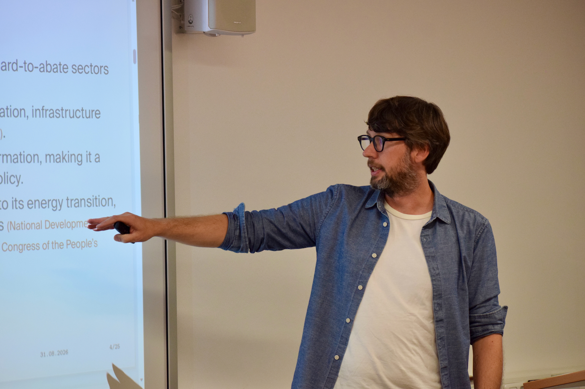

::: {.rp-intro}

My research sits at the intersection of **international economics, industrial policy and environmental economics**. I study how **global value chains and foreign direct investment** shape firm behaviour and environmental performance, and how **industrial policy** influences technological competition and the green transformation.

My empirical work draws primarily on firm-level and policy data from China, India and European economies. I combine information on firms' production, ownership and international activities with measures of innovation, emissions, pollution abatement and environmental management, using applied microeconometric methods to study how firms respond to international integration and policy interventions.

:::

## Selected Peer-Reviewed Publications

:::: {.rp-publications .rp-selected}

::: {.rp-paper #paper-upstreamness}

<a class="rp-link" href="https://doi.org/10.1016/j.jeem.2026.103324">Journal of Environmental Economics and Management</a> · 2026 · 138, 103324

### Upstreamness, Foreign Environmental Regulation and CO₂ Emissions in Indian Manufacturing Firms {.rp-title}

F. O. Semrau

Short summary: Upstreamness, Foreign Environmental Regulation and CO₂ Emissions in Indian Manufacturing Firms

Indian manufacturers further upstream emit more CO₂, both in absolute terms and relative to output. This relationship weakens in industries more exposed to stringent environmental regulation in export markets.

:::

::: {.rp-paper #paper-csr}

<a class="rp-link" href="https://doi.org/10.1016/j.jdeveco.2023.103236">Journal of Development Economics</a> · 2024 · 167, 103236

### Corporate Social Responsibility along the Global Value Chain {.rp-title}

P. Herkenhoff, S. Krautheim, F. O. Semrau and F. Steglich

Short summary: Corporate Social Responsibility along the Global Value Chain

A model of sequential production predicts greater corporate social responsibility closer to final consumers. Indian firm-level data support this prediction: downstream firms spend more on staff welfare and local communities.

:::

::: {.rp-paper #paper-green-gifts}

<a class="rp-link" href="https://doi.org/10.1057/s42214-025-00228-4">Journal of International Business Policy</a> · 2026 · 9, 82–101

### Green Gifts from Abroad? FDI and Firms' Green Management {.rp-title}

P. Kannen, F. O. Semrau and F. Steglich

Short summary: Green Gifts from Abroad? FDI and Firms' Green Management

Across 31 countries, foreign ownership is associated with greater adoption of green management practices. The relationship depends on host-country income and the environmental performance of the countries supplying its FDI.

:::

::::

::: {.rp-talk-photo}

{fig-alt="Research presentation"}

:::

## Further Peer-Reviewed Publications

:::: {.rp-publications}

::: {.rp-paper #paper-coffee}

<a class="rp-link" href="https://doi.org/10.1002/jid.70033">Journal of International Development</a> · 2026 · 38(1), 88–111

### Climbing the Coffee Global Value Chain—Three Decades of Trade and Upgrading {.rp-title}

A. Hanley, W.-H. Liu, F. O. Semrau and D. Görlich

Short summary: Climbing the Coffee Global Value Chain—Three Decades of Trade and Upgrading

Trade data for 1991–2018 document uneven progress from raw coffee exports to processing. Industrial capacity, proximity to processing hubs, coffee varieties and trade policy are associated with different upgrading paths.

:::

::: {.rp-paper #paper-rd-support}

<a class="rp-link" href="https://doi.org/10.1080/09640568.2024.2359442">Journal of Environmental Planning and Management</a> · 2026 · 69(1), 1–27

### It's Not a Sprint, It's a Marathon: Reviewing Governmental R&amp;D Support for Environmental Innovation {.rp-title}

L. P. Meissner, S. Peterson and F. O. Semrau

Short summary: It's Not a Sprint, It's a Marathon: Reviewing Governmental R&amp;D Support for Environmental Innovation

The review finds that emissions pricing alone is insufficient to stimulate environmental innovation. Theory and evidence support complementing it with public R&amp;D funding to advance clean technologies and reduce emissions.

:::

::: {.rp-paper #paper-ict}

<a class="rp-link" href="https://doi.org/10.1016/j.techfore.2025.123985">Technological Forecasting &amp; Social Change</a> · 2025 · 213, 123985

### Connecting the Unconnected? Social Ties and ICT Adoption among Smallholder Farmers in Developing Countries {.rp-title}

L. Kleemann and F. O. Semrau

Short summary: Connecting the Unconnected? Social Ties and ICT Adoption among Smallholder Farmers in Developing Countries

Household data from 12 developing countries link weaker social connections to lower uptake of digital technologies and poorer access to agricultural advice. Digitalisation can therefore reinforce existing information inequalities among smallholder farmers.

:::

::: {.rp-paper #paper-exports}

<a class="rp-link" href="https://doi.org/10.1080/13662716.2021.2021865">Industry &amp; Innovation</a> · 2022 · 29(5), 672–700

### Stepping Up to the Mark? Firms' Export Activity and Environmental Innovation in 14 European Countries {.rp-title}

A. Hanley and F. O. Semrau

Short summary: Stepping Up to the Mark? Firms' Export Activity and Environmental Innovation in 14 European Countries

Exporting is associated with greener production processes, particularly in Eastern European firms. Across the sample, exposure to export markets with stringent market-based environmental policies is linked to greater adoption of environmental innovations.

:::

::: {.rp-paper #paper-brazil}

<a class="rp-link" href="https://doi.org/10.1002/jid.3276">Journal of International Development</a> · 2017 · 29(3), 287–307

### Brazil's Development Cooperation: Following in China's and India's Footsteps? {.rp-title}

F. O. Semrau and R. Thiele

Short summary: Brazil's Development Cooperation: Following in China's and India's Footsteps?

Brazil's development cooperation is shaped mainly by historical and cultural links, with some attention to recipient need and governance. The findings challenge the idea that emerging donors allocate aid solely to advance their own interests.

:::

::::

## Other Academic Publications

::: {.rp-chapter}

### Firms' Global Value Chain Participation and Its Environmental Performance: A Review of the Empirical Literature {.rp-title}

F. O. Semrau · 2023

In F. J. Díaz López, M. Mazzanti and R. Zoboli (eds.), <a class="rp-link" href="https://doi.org/10.4337/9781802200065.00016">Handbook on Innovation, Society and the Environment</a>. Edward Elgar Publishing, pp. 125–139.

:::

## Work in Progress

:::: {.rp-work-grid}

::: {.rp-work}

### Unveiling the Green Trail: FDI, Global Value Chains and Firm Pollution in China {.rp-title}

With Holger Görg, Lars Hecker and Zheng Wang

*Under review*

How foreign ownership and firms' positions in global value chains interact in shaping pollution abatement in Chinese manufacturing.

:::

::: {.rp-work}

### Tournament Industrial Policy: China's Subnational Competition for Hydrogen Leadership {.rp-title}

With Benno Schöl and Jian Zhang

How subnational governments in China compete for hydrogen leadership and how their policy choices affect technological innovation.

:::

::: {.rp-work}

### Green Public Financial Support and the Policy Mix: Drivers of Firms' Environmental Innovation {.rp-title}

Single-authored

How green public financial support interacts with regulation and market incentives in firms' adoption of environmental innovations.

:::

::: {.rp-work}

### Disentangling the Effects of Domestic Customer Collaboration on Exports: The Information and Innovation Effects {.rp-title}

With Dirk Dohse, Aoife Hanley and Christina Raasch

Whether collaboration with domestic customers helps firms export through better market information and innovation.

:::

::::

## Invited Seminars, Conferences & Workshops

:::: {.rp-work-grid}

::: {.rp-work}

### Invited Seminars {.rp-title}

- Université Paris 1 Panthéon-Sorbonne  
  July 2027 (scheduled), Paris, France

- Tinbergen Institute Spatial Economics Seminar  
  February 2027 (scheduled), Amsterdam, Netherlands

- Vrije Universiteit Amsterdam  
  November 2026 (scheduled), Amsterdam, Netherlands

- German Council of Economic Experts  
  2026, Berlin, Germany

- European Commission JRC Industrial Innovation and Dynamics Seminar  
  2023, Seville, Spain

- Department of Economics and Management, University of Ferrara  
  2022, Ferrara, Italy

- Trinity College Economic Seminar  
  2019, Dublin, Ireland

:::

::: {.rp-work}

### Selected Conferences {.rp-title}

- World Congress of Environmental and Resource Economists (WCERE)  
  2026, Lisbon, Portugal

- DRUID Conference  
  2026 and 2019 (poster), Copenhagen, Denmark

- GDE Conference and 1st Conference of the EDEG  
  2026, Kiel, Germany

- Geography of Innovation Conference (GeoInno)  
  2026, Budapest, Hungary

- Kiel–Göttingen–CEPR Conference on China in the Global Economy  
  2025, Berlin, Germany

- European Association of Environmental and Resource Economists (EAERE) Annual Conference  
  2024, Leuven, Belgium; 2021, online and 2019, Manchester, United Kingdom

- European Trade Study Group (ETSG) Annual Conference  
  2024, Athens, Greece and 2019, Bern, Switzerland

- Verein für Socialpolitik Annual Meeting  
  2022, Basel, Switzerland and 2019, Leipzig, Germany

- Research Conference “Sustainability in Global Value Chains”, co-organised by UNIDO  
  2021, online

- Economic Geography and International Trade Research Meeting  
  2020, Kiel, Germany

- PEGNet Conference  
  2019 (poster), Bonn, Germany

:::

::: {.rp-work}

### Selected Workshops & Symposia {.rp-title}

- Economics of Low-Carbon Markets  
  2026, Oldenburg, Germany

- Symposium “Europe's Industrial Policy Options in the Digital, Green and Geoeconomic Transitions”  
  2026, Hannover, Germany

- Aarhus–Kiel Workshop  
  2025, 2024, 2018 and 2017, Sonderborg, Denmark

- Society for Eco-Innovation Studies Workshop  
  2024, HEC Paris, France

- SEEDS Annual Workshop  
  2023, Ferrara, Italy; 2020, online

- Göttingen Workshop on International Economics  
  2022, 2020 and 2019, Göttingen, Germany

- Centre for Research in Circular Economy, Innovation and SMEs Workshop  
  2019, Ferrara, Italy

- INFER Workshop on Environment and Development Economics  
  2019, Coimbra, Portugal

:::

::::

::: {.rp-footer}

Policy publications and public commentary are listed under [Policy & Media](policy.qmd){.rp-link}.

:::

